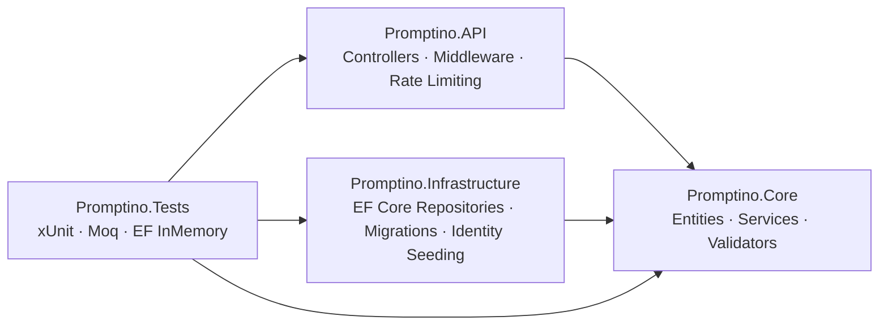
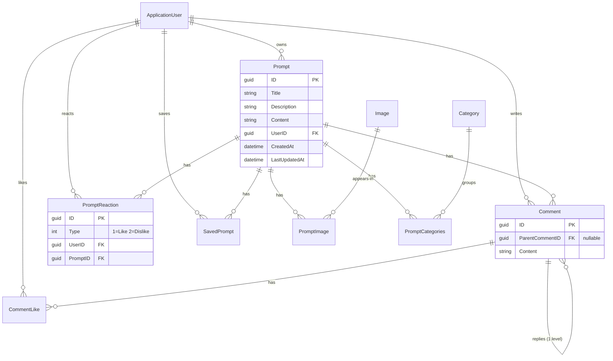

<div align="center">

# Promptino

**Discover, share, and manage AI prompts.**

A production-minded REST API for a community prompt library — publish prompts, attach generated images, organize with categories, and engage through reactions, threaded comments, and bookmarks.

[](https://github.com/atymri/Promptino/actions/workflows/ci.yml)
[](https://dotnet.microsoft.com/)
[](#testing)
[](https://github.com/atymri/Promptino/pulls)
[](#license)

</div>

---

## Table of Contents

- [Why Promptino](#why-promptino)
- [Architecture](#architecture)
- [Features](#features)
- [Tech Stack](#tech-stack)
- [Database Schema](#database-schema)
- [Getting Started](#getting-started)
- [Configuration](#configuration)
- [API Reference](#api-reference)
- [Validation Rules](#validation-rules)
- [Error Handling](#error-handling)
- [Testing](#testing)
- [Security Notes](#security-notes)
- [Roadmap](#roadmap)

## Why Promptino

Prompt-sharing sites lock your library inside someone else's product. Promptino is the API layer for owning that experience:

```
Before                          After
──────────────────────────      ──────────────────────────────
Prompts in random docs     →    Searchable, categorized library
No idea what works         →    Likes/dislikes and comment threads
Losing your favorites      →    Persistent bookmarks per account
One curator, gatekeeping   →    Every user publishes; admins moderate
```

Every registered user owns their content end-to-end: create, edit, version, delete. The public feed exposes engagement counts so quality surfaces naturally — no algorithm, just reactions.

## Architecture

Clean Architecture, dependencies pointing inward only:



| Project | Responsibility |
|---|---|
| `Promptino.API` | HTTP layer, JWT auth, rate limiting, global exception handling |
| `Promptino.Core` | Domain entities, DTOs, service contracts/implementations, FluentValidation, AutoMapper profiles |
| `Promptino.Infrastructure` | EF Core `ApplicationDbContext`, repositories, migrations, role seeding |
| `Promptino.Tests` | Service business rules, ownership enforcement, repository behavior |

## Features

### Content ownership
Any authenticated user can create, update, and delete **their own** prompts. Admins bypass ownership checks for moderation — enforced at the service layer, not just the controller.

### Engagement model
- **Reactions** — Like/Dislike with YouTube semantics: one reaction per user per prompt (unique index), same-value re-click removes, opposite switches
- **Comments** — one reply level deep, normalized at write time so reads build the tree in a single pass
- **Comment likes** — unique per user per comment

### Performance & resilience
- **Pagination everywhere** — every public list endpoint returns `PagedResult<T>` (`items`, `page`, `pageSize`, `totalCount`, `totalPages`); default 25, hard cap 100
- **Rate limiting** — per-IP fixed windows: strict budget on auth endpoints (brute-force surface), generous globally; rejections return RFC 7807 problem details in Persian
- **Bounded queries** — comment listing pages over root comments only; replies ride along with their parents

### Platform
- JWT access + refresh tokens, email confirmation, password reset flow via MailKit
- Role-based authorization (`Admin` / `User`) seeded automatically on startup
- Admin-curated categories and image library (up to 6 images per prompt)

## Tech Stack

| Layer | Technology |
|---|---|
| Runtime | ASP.NET Core 8.0 |
| ORM | Entity Framework Core 8.0 |
| Database | SQL Server |
| Auth | ASP.NET Core Identity + JWT Bearer |
| Mapping | AutoMapper 16 (+ ExpressionMapping) |
| Validation | FluentValidation |
| Email | MailKit / MimeKit |
| Testing | xUnit, Moq, EF Core InMemory — 168 tests |

## Database Schema



**Delete behavior:** everything cascades from `Prompt`. User-side FKs are `NO ACTION` — SQL Server forbids multiple cascade paths, and user deletion is an explicit operation requiring cleanup of owned prompts first.

## Getting Started

### Prerequisites

- [.NET 8 SDK](https://dotnet.microsoft.com/download/dotnet/8.0)
- SQL Server (LocalDB, Docker, or full instance)

> Quick database via Docker:
>
> ```bash
> docker run -e "ACCEPT_EULA=Y" -e "MSSQL_SA_PASSWORD=Your_password123" -p 1433:1433 -d mcr.microsoft.com/mssql/server:2022-latest
> ```

### Setup

1. **Clone and restore**

   ```bash
   git clone https://github.com/atymri/Promptino.git
   cd Promptino
   dotnet restore
   ```

2. **Configure secrets**

   No secrets live in this repository. Provide them via user-secrets (Development) or environment variables (production):

   ```bash
   cd Promptino.API
   dotnet user-secrets init
   dotnet user-secrets set "ConnectionStrings:Default" "Server=localhost;Database=Promptino;Trusted_Connection=True;Encrypt=False"
   dotnet user-secrets set "JwtOptions:SecretKey" "<random-key-min-32-chars>"
   dotnet user-secrets set "SeedAdmin:Email" "admin@yourdomain.com"
   dotnet user-secrets set "SeedAdmin:UserName" "admin"
   dotnet user-secrets set "SeedAdmin:Password" "<strong-password>"
   # Optional — enables confirmation/reset emails:
   dotnet user-secrets set "EmailCredentials:StmpPassword" "<smtp-app-password>"
   ```

3. **Run**

   ```bash
   dotnet run --project Promptino.API
   ```

   In Development, pending migrations apply automatically and the seed admin is created from configuration. Outside Development, set `Database:MigrateOnStartup=true` or run `dotnet ef database update` explicitly.

4. **Explore** — Swagger UI is served at [`/swagger`](http://localhost:5007/swagger) in Development.

## Configuration

| Key | Purpose |
|---|---|
| `ConnectionStrings:Default` | SQL Server connection string *(secret)* |
| `JwtOptions:SecretKey` | Token signing key *(secret)* |
| `JwtOptions:Issuer` / `Audience` | Token validation targets |
| `JwtOptions:ExpiryInMinutes` | Access token lifetime (default `60`) |
| `JwtOptions:RefreshTokenExpiryInMinutes` | Refresh token lifetime (default `120`) |
| `EmailCredentials:StmpPassword` | SMTP app password *(secret)* |
| `SeedAdmin:Email` / `UserName` / `Password` | Bootstrap admin *(secret — seeding skips if absent)* |
| `Cors:AllowedOrigins` | JSON array of origins; empty = allow any (dev) |
| `Database:MigrateOnStartup` | Force auto-migration outside Development |

## API Reference

Interactive docs at `/swagger`. All list endpoints accept `?page=&pageSize=` and return `PagedResult<T>`.

<details>
<summary><strong>Authentication</strong></summary>

| Method | Route | Auth |
|---|---|---|
| POST | `/api/Auth/register` | Public* |
| POST | `/api/Auth/login` | Public |
| GET | `/api/Auth/logout` | Public |
| POST | `/api/Auth/new-access-token` | Public |
| POST | `/api/Auth/forget-password` | Public |
| POST | `/api/Auth/reset-password` | Public |

\* Registration sends a confirmation email; configure SMTP first.
</details>

<details open>
<summary><strong>Prompts</strong></summary>

| Method | Route | Auth |
|---|---|---|
| GET | `/api/Prompts` | Public |
| GET | `/api/Prompts/{id}` | Public |
| GET | `/api/Prompts/search?keyword=` | Public |
| POST | `/api/Prompts` | User |
| PUT | `/api/Prompts` | Owner / Admin |
| DELETE | `/api/Prompts/{id}` | Owner / Admin |
| GET | `/api/Prompts/my` | User |
</details>

<details>
<summary><strong>Saves</strong></summary>

| Method | Route | Auth |
|---|---|---|
| GET | `/api/Prompts/saves` | User |
| POST | `/api/Prompts/saves` | User |
| DELETE | `/api/Prompts/saves/{promptId}` | User |
| GET | `/api/Prompts/saves/count/{promptId}` | Public |
| GET | `/api/Prompts/saves/{promptId}/status` | User |
</details>

<details>
<summary><strong>Reactions</strong></summary>

| Method | Route | Auth |
|---|---|---|
| PUT | `/api/Prompts/{promptId}/reaction` | User |
| DELETE | `/api/Prompts/{promptId}/reaction` | User |
| GET | `/api/Prompts/{promptId}/reaction/state` | Public |

Body: `{ "type": 1 }` — `1` = Like, `2` = Dislike. Same value again un-toggles; opposite value switches.
</details>

<details>
<summary><strong>Comments</strong></summary>

| Method | Route | Auth |
|---|---|---|
| GET | `/api/prompts/{promptId}/comments` | Public |
| POST | `/api/prompts/{promptId}/comments` | User |
| DELETE | `/api/prompts/{promptId}/comments/{commentId}` | Author / Admin |
| PUT | `/api/prompts/{promptId}/comments/{commentId}/like` | User |
| DELETE | `/api/prompts/{promptId}/comments/{commentId}/like` | User |
</details>

<details>
<summary><strong>Categories</strong> <em>(Admin-managed)</em></summary>

| Method | Route | Auth |
|---|---|---|
| GET | `/api/Categories` · `/search` · `/{name}` | Public |
| POST / PUT / DELETE | `/api/Categories[...]` | Admin |
| POST / DELETE | `/api/Categories/assign` | Admin |
</details>

<details>
<summary><strong>Images & Roles</strong> <em>(Admin-only)</em></summary>

Images — upload, update, delete, assign/unassign to prompts: `/api/Images/*`
Roles — list, create, assign/remove users: `/api/Roles/*`

Full request/response shapes in Swagger.
</details>

## Validation Rules

| Field | Rule |
|---|---|
| Password | Uppercase + lowercase + digit + special char, min 6 chars |
| Prompt title | 3–50 chars |
| Prompt description | 10–150 chars |
| Prompt content | 30–2000 chars |
| Comment | 2–500 chars |
| Image extensions | `.jpg` `.jpeg` `.png` `.gif` `.bmp` `.webp` `.svg` |
| Email | Recognized provider domains |
| Phone | 11-digit Iranian mobile format |

Validation failures return structured problem details in Persian.

## Error Handling

Global middleware maps domain exceptions to RFC 7807 problem details:

| Status | Trigger |
|---|---|
| `400` | Invalid input / validation failure |
| `401` | Missing or malformed credentials |
| `403` | Not the owner of the resource |
| `404` | Resource not found |
| `409` | Conflict — already saved, duplicate reaction |
| `429` | Rate limit exceeded |
| `500` | Unexpected error (stack trace included in Development only) |

## Testing

```bash
dotnet test
```

168 tests across three layers:

- **Service tests** — business rules, ownership enforcement, reaction toggle semantics, comment threading
- **Repository tests** — CRUD against EF InMemory, including explicit cascade cleanup where the database would normally handle it
- **Validation scenarios** — FluentIntegration rules and exception mapping

## Security Notes

- Zero secrets in the repository — user-secrets (dev) or environment variables (prod)
- The original JWT key, SMTP password, and admin password were rotated out of git history during development; forked before then? Rotate your copies
- Rate limiting partitions by client IP — behind a load balancer, ensure your proxy forwards real client IPs (`X-Forwarded-For`)
- Auto-migration is Development-only by default; production applies migrations deliberately

## Roadmap

- [ ] Cursor-based pagination for high-churn feeds
- [ ] Report/moderation queue instead of reactive deletion
- [ ] Prompt version history
- [ ] Full-text search (EF Core `FTS`)
- [ ] Refresh-token rotation with reuse detection

## License

This project is for educational purposes.
